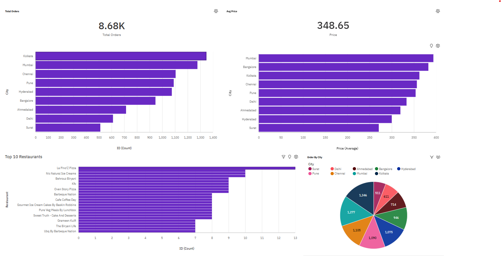

# 🍽️ Swiggy Data Analysis Dashboard (IBM Cognos)

## 📌 About this project

I created this project to understand how food delivery data can be used to extract meaningful insights. I worked with a Swiggy dataset, cleaned it, and built a dashboard using IBM Cognos to analyze orders, pricing, and restaurant performance.

---

## 🎯 What I wanted to learn

* How to work with raw and messy data
* How to clean and prepare data for analysis
* How to build dashboards in Cognos
* How to extract insights from visualizations

---

## 🛠️ Tools used

* IBM Cognos Analytics
* SQL
* Excel / CSV

---

## 📊 Dashboard

---

## 🔍 What I did

* Started with a raw dataset (`swiggy_raw_data.csv`)
* Cleaned and structured it (`swiggy_clean_data.csv`)
* Used SQL queries to explore the data
* Built a dashboard to visualize key metrics

---

## 📈 Key Insights

* Cities like **Mumbai and Kolkata** have the highest number of orders
* **Average price is higher in metro cities**, especially Mumbai
* A few restaurants contribute a large portion of total orders
* Demand is clearly not uniform — some cities are much more active
* Pricing and demand vary across cities, showing different customer behavior

---

## ⚠️ Challenges I faced

One major issue was the **Food Type column**.
It had multiple values in a single row (like *"North Indian, Chinese"*), which made it difficult to analyze properly.

Because of this:

* Pie chart distribution was not very accurate
* Counts sometimes appeared equal

In a real-world project, I would solve this by **splitting and cleaning categories properly**.

---

## 💡 What I learned

This project helped me understand that:

* Data cleaning is as important as visualization
* Not all datasets are perfect
* Good analysis also means explaining data limitations

---

## 🚀 Future improvements

* Clean food category column properly
* Add time-based analysis (orders by time/day)
* Improve dashboard interactivity

---

## 🙌 Final thought

This project was a great learning experience for me. It gave me a complete idea of how data flows from raw format to insights.

---

👩‍💻 Created by: *[Suhani Suman Sahoo]*
